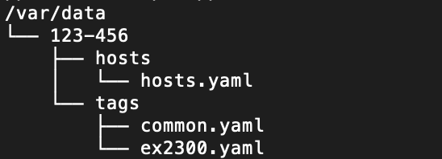
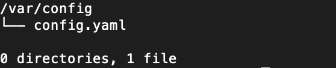

# Junos Install OS Service

## Description
This is designed as a simple microservice to install the Junos OS on *X family of devices.  It wraps the usage of the [Juniper PyEZ library](http://forums.juniper.net/t5/Automation/Where-can-I-learn-more-about-Junos-PyEZ/ta-p/280496
) to perform the action of installing the Junos OS based on a yaml defined inventory.

The docker image is a microservice, it does not do anything other than install the specified version of the Junos OS on the devices in the inventory. The intention is to expose as much as possible the functionality of the **Request Software Package Add** rpc call as a microservice.
```
<rpc-reply xmlns:junos="http://xml.juniper.net/junos/15.1X49/junos">
    <rpc>
        <request-package-add>
                <reboot/>
                <no-copy/>
                <no-validate/>
                <package-name/>
        </request-package-add>
    </rpc>
    <cli>
        <banner></banner>
    </cli>
</rpc-reply>
```
## Important Convention

### File Structure
By convention, the following file structure is required inside the running docker container.





##### /var/data/[WORKFLOW_SERVICE_KEY]

The value ```123-456``` is a unique folder that must be passed in as an environmental variable: ```WORKFLOW_SERVICE_KEY=123-456```. This can be any folder but must be passed as the environmental variable.

Within the ```WORKFLOW_SERVICE_KEY``` lives the mandatory directory ```hosts``` with the mandatory file ```hosts.yaml```.  The ```hosts.yaml``` contains the following ```yaml``` code:
```
---
inventory:
  - hostname: base-2300-48p-1
    management_ip: 192.168.101.4
    vendor: juniper
    tags:
      - ex2300
      - common
    data:
      jumphost:
        local_port: 10022
      hostname: base-2300-48p-1
      address: 192.168.101.4
      package: "ex2300-15.1X53-D59.4.tgz"
      os_version: 15.1X53-D59.4 #
  - hostname: base-2300-48p-2
    management_ip: 192.168.101.5
    vendor: juniper
    tags:
      - ex2300
      - common
    data:
      jumphost:
        local_port: 10023
      hostname: base-2300-48p-4
      address: 192.168.101.5
      package: "ex2300-15.1X53-D56.tgz"
      os_version: 15.1X53-D56
```
The ```inventory``` key is an array of devices to connect to and install the OS. The ```management_ip``` key is required to connect to the device.

The ```tags``` key is an array of values that corresponds to ```yaml``` files in the ```/var/tags``` directory.  These files contain data that aids the OS install microservice.  In the example above, there are two tags, ```ex2300``` and ```common```, these tags correspond to the example file structure ```/var/tags/ex2300.yaml``` and ```/var/tags/common.yaml```.

The ```data``` key is key/value pair data that aids in the OS install microservice.

#### /var/config
The ```config.yaml``` file is used to aid in the OS install microservice, its intent is to provide data that shapes how the service performs the installation.  An example file:
```
---
install:
  verify_os: True
  retries: 3
  initial_wait: 720
  interval: 180
```
Key | Use Description
------------ | -------------
```verify_os``` | instructs the service to verify the requested version of the OS has been installed.
```retries```   | number of retries to attempt to connect to device after install OS, this relates to the ```verify_os``` key
```initial_wait``` | wait in seconds after the reboot of the device.  this relates to the ```verify_os``` key
```interval``` | wait in seconds after the ```initial_wait``` value is exceeded to try and connect to the device.  this relates to ```verify_os``` and ```retries```.

### Data Conventions and Precedence
The hierarchical setup of the host and tags allows you to merge and override the data used by the microservice.  Let's use a snippet from the yaml file above as an example:
```
tags:
  - ex2300
  - common
```
The rule is from bottom up, the data is more specific and has more precedence than the key below it. Order of precedence is ```ex2300``` is more specific than ```common```.  Given that rule the data in the ```ex2300.yaml``` file will overide any data in the ```common.yaml``` file.  Now factor in the ```host.yaml``` file and ```data``` key.  That file has the highest precedence and will override the data within ```tags```.
```
hosts.yaml
---
    data:
      jumphost:
        local_port: 10022
      hostname: base-2300-48p-1
      address: 192.168.101.4
      package: "ex2300-15.1X53-D59.4.tgz"
      os_version: 15.1X53-D59.4 #
```
and
```
ex2300.yaml
---
os_version: 15.1X53-D59.4 #15.1X53-D59.4 #
package: "ex2300-15.1X53-D56.tgz"
```
and
```
common.yaml
---
username: juniper
password: Password
transport: ssh
port: 22
jumphost:
  server: X.X.X.X
  username: juniper
  password: Password
  port: 22
#local:
#  package_dir: /var/tmp
remote:
  hostname: X.X.X.X
  password: Password
  username: juniper
  package_dir: /data/images
```
Our final data available to the OS install will be the following:
```
username: juniper
password: Password
transport: ssh
port: 22
hostname: base-2300-48p-1
address: 192.168.101.4
package: "ex2300-15.1X53-D59.4.tgz"
os_version: 15.1X53-D59.4
jumphost:
  local_port: 10022
    server: X.X.X.X
    username: juniper
    password: Password
    port: 22
remote:
  hostname: X.X.X.X
  password: Password
  username: juniper
  package_dir: /data/images
```
